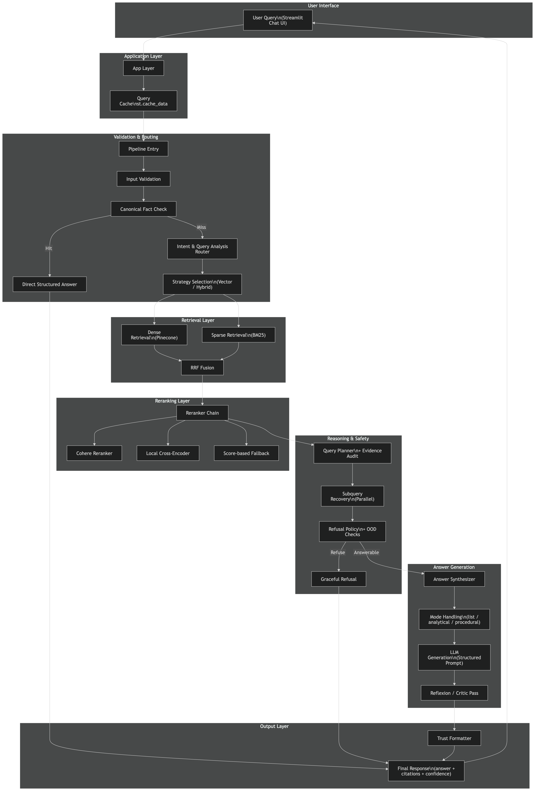

# Nexus RAG Interview Coach

Production-grade, domain-specific RAG application for AI/ML interview preparation.

Nexus RAG answers questions about retrieval-augmented generation, embeddings, vector search, LLMs, prompt engineering, alignment, evaluation metrics, and production readiness. The system is grounded in a curated AI/ML corpus and exposes citations, confidence, latency, answer mode, and trace signals for every query.

## Status

Ready for controlled public deployment as a Streamlit app.

The system has been evaluated across in-domain interview questions, generalization questions, adversarial prompts, prompt-injection attempts, out-of-domain requests, conflict handling, and production-readiness scenarios.

## Core Capabilities

- Section-aware ingestion and chunking for structured AI/ML documents
- OpenAI `text-embedding-3-large` embeddings
- Pinecone vector database with namespace isolation
- Hybrid retrieval with dense search and BM25
- Cohere reranker with fallback chain:
  - local cross-encoder reranker
  - embedding-score ranking
  - original retrieval order
- Intent-aware answer modes for factual, list, relationship, analytical, procedural, reasoning, enterprise, and safety questions
- Reflexion-style answer checking and repair
- Prompt-injection and out-of-domain handling
- Per-query observability:
  - detected intent
  - retrieved chunks
  - reranked chunks
  - used chunks
  - answer mode
  - critic/reflexion result
  - citations
  - confidence
  - latency

## App

The public app entrypoint is:

```bash
streamlit run app.py
```

The app includes:

- Chat-style AI/ML interview practice
- Curated example prompts for quick starts
- Source and trust expanders under each answer
- Hidden raw JSON by default for public deployment
- Advanced pipeline reload control for cache refreshes

## Architecture



```text
User Query (Streamlit Chat UI)
  -> App Layer + Query Cache
  -> Pipeline Entry + Input Validation
  -> Canonical Fact Check
     -> Hit: Direct Structured Answer
     -> Miss: Intent Router + Strategy Selection (Vector/Hybrid)
  -> Dense Retrieval (Pinecone) + Sparse Retrieval (BM25)
  -> RRF Fusion
  -> Reranker Chain (Cohere -> Local Cross-Encoder -> Score Fallback)
  -> Query Planner + Evidence Audit + Subquery Recovery (Parallel)
  -> Refusal Policy + OOD Checks
     -> Refuse: Graceful Refusal
     -> Answerable: Answer Synthesizer
  -> Mode Handling + Structured LLM Generation + Reflexion/Critic
  -> Trust Formatter
  -> Final Response (answer + citations + confidence)
```

## Repository Layout

```text
app.py                         Public Streamlit app
main.py                        Pipeline factory
DEPLOYMENT.md                  Deployment guide
runtime.txt                    Python runtime for hosted deployment
requirements.txt               Python dependencies

src/
  pipeline/                    RAG and ingestion pipelines
  retrieval/                   Vector, BM25, hybrid retrieval, routing, reranking
  generation/                  Answer synthesis, refusal handling, trust formatting
  evaluation/                  Evaluation and aggregation scripts
  observability/               Metrics and trace helpers

data/evaluation/               Regression and generalization eval sets
cache/bm25_index.pkl           BM25 cache used for hybrid retrieval
.streamlit/config.toml         Streamlit app config/theme
.streamlit/secrets.example.toml Secret template for deployment
```

## Local Setup

```bash
python -m venv venv
source venv/bin/activate
pip install -r requirements.txt
```

Set environment variables locally:

```bash
export OPENAI_API_KEY="..."
export PINECONE_API_KEY="..."
export PINECONE_INDEX_NAME="nexus-rag"
export COHERE_API_KEY="..."
```

Run the app:

```bash
streamlit run app.py
```

## Deployment

Recommended deployment target: Streamlit Community Cloud.

1. Push the repository to GitHub.
2. Create a Streamlit app with entrypoint `app.py`.
3. Add secrets in Streamlit Cloud.
4. Keep raw debug disabled for public deployment.

Required secrets:

```toml
OPENAI_API_KEY = "..."
PINECONE_API_KEY = "..."
PINECONE_INDEX_NAME = "nexus-rag"
```

Recommended:

```toml
COHERE_API_KEY = "..."
NEXUS_SHOW_DEBUG = "false"
```

See [DEPLOYMENT.md](DEPLOYMENT.md) for the deployment checklist.

## Evaluation

Run targeted or full evaluations with:

```bash
venv/bin/python src/evaluation/run_evaluation.py
venv/bin/python src/evaluation/aggregate_eval_metrics.py
venv/bin/python src/evaluation/aggregate_rag_quality_metrics.py
```

The current evaluation stack checks:

- answer quality
- hallucination rate
- refusal rate
- Recall@k
- MRR
- nDCG
- context precision
- context recall
- citation precision/recall
- faithfulness
- latency

## Production Notes

- `cache/bm25_index.pkl` should be included in deployment for full hybrid retrieval.
- If Cohere is rate-limited, the local reranker fallback keeps the system functional.
- Local reranking is slower than hosted reranking, so monitor p95 and p99 latency.
- Public deployment should keep `NEXUS_SHOW_DEBUG=false`.
- Real secrets must never be committed. Use Streamlit Cloud secrets or environment variables.

## Scope

Nexus RAG is a domain-specific AI/ML interview-prep assistant. It should answer grounded AI/ML questions and gracefully avoid unrelated live/current, medical, legal, financial, or general-purpose requests.
